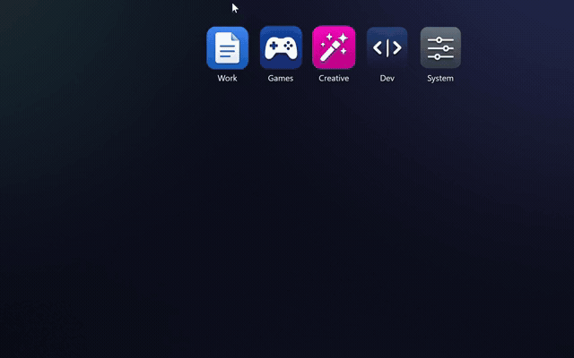

# DeskRipple

**Folder docks for your Windows 10 and 11 desktop.** DeskRipple puts folder icons right on
your desktop — sitting behind your windows like native icons — that expand on hover or
click into a grid of shortcuts. Keep your desktop tidy without giving up one-click access.

*Grid is one of five expand styles — Grid, Column, Row, Fan, and a 360° Ring.*

🌐 **Website & live demo:** <https://deskripple.com>
⬇️ **Download (free beta):** **[DeskRipple-beta-Setup.exe](https://github.com/DeskRipple/deskripple/releases/latest/download/DeskRipple-beta-Setup.exe)**

This repository hosts the **public beta binaries and documentation** for DeskRipple.
It does not contain source code.

---

## Download & install

**Runs on Windows 10 (22H2) and Windows 11, 64-bit** — no separate .NET runtime to install, and no admin rights needed.

- **Installer (recommended):** [DeskRipple-beta-Setup.exe](https://github.com/DeskRipple/deskripple/releases/latest/download/DeskRipple-beta-Setup.exe) — installs per-user and keeps itself up to date automatically (you can turn that off in Settings).
- **Portable ZIP:** [DeskRipple-beta-Portable.zip](https://github.com/DeskRipple/deskripple/releases/latest/download/DeskRipple-beta-Portable.zip)
- **All releases:** <https://github.com/DeskRipple/deskripple/releases>

The build is code-signed, but a brand-new app can still trigger a Windows SmartScreen
notice on first run — if you see one, choose **More info → Run anyway**.

> ⚠️ **Free beta — this build stops working on September 1, 2026.** It is provided
> **as-is** and you should expect rough edges. By downloading you agree to the
> [beta license (EULA)](EULA.md).

## Documentation

- 🖥️ [System requirements](SYSTEM_REQUIREMENTS.md) — what you need to run it
- ❓ [Beta FAQ &amp; known limitations](BETA-FAQ.md) — install, uninstall, updates, gotchas
- 🔒 [Privacy policy](PRIVACY.md) — what's collected (opt-in, off by default)
- 📄 [EULA](EULA.md) — the beta license you accept on install
- 📝 [Third-party notices](THIRD-PARTY-NOTICES.txt) — open-source components

## Feedback

Hit a bug or have an idea? **[Send feedback](https://tally.so/r/eqzJZx)** or email
**<support@deskripple.com>**.

## License

**Proprietary software — © Michael Kline. All rights reserved.**

The binaries are distributed under the terms of the
[End-User License Agreement (EULA.md)](EULA.md). No source code is included in this
repository, and no license or rights are granted except as expressly stated in the EULA.
